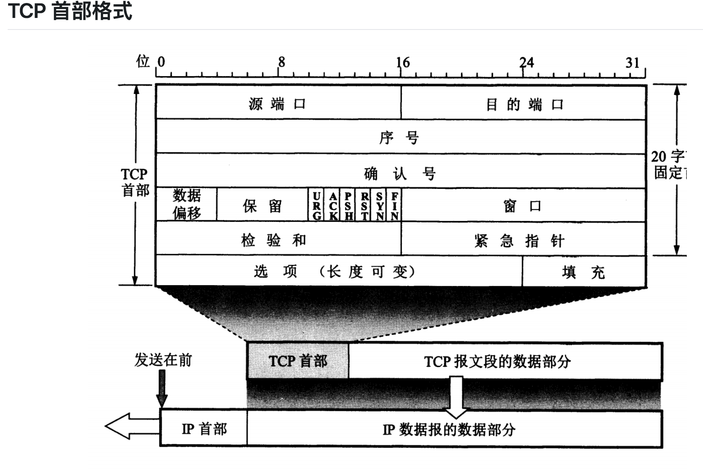
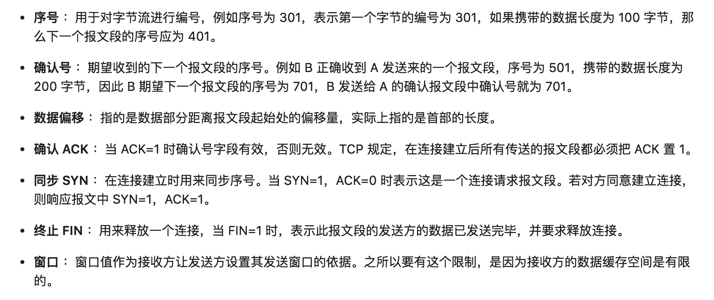

# 计算机网络体系结构
 
  
  

##  计算机网络体系结构  
 ### 1. 五层协议
 
 -  **应用层** ：为特定应用程序提供数据传输服务，为用户提供服务和协议。例如 HTTP、DNS 等。数据单位为报文。是计算机用户，以及各种应用程序和网络之间的接口。
 
 -  **传输层** ：为进程提供通用数据传输服务。由于应用层协议很多，定义通用的传输层协议就可以支持不断增多的应用层协议。运输层包括两种协议：传输控制协议 TCP，提供面向连接、可靠的数据传输服务，数据单位为报文段；用户数据报协议 UDP，提供无连接、尽最大努力的数据传输服务，数据单位为用户数据报。TCP 主要提供完整性服务，UDP 主要提供及时性服务。
 
 -  **网络层** ：为主机提供数据传输服务。而传输层协议是为主机中的进程提供数据传输服务。网络层把传输层传递下来的报文段或者用户数据报封装成分组。
 
 -  **数据链路层** ：网络层针对的还是主机之间的数据传输服务，而主机之间可以有很多链路，链路层协议就是为同一链路的主机提供数据传输服务。数据链路层把网络层传下来的分组封装成帧。
 
 -  **物理层** ：考虑的是怎样在传输媒体上传输数据比特流，而不是指具体的传输媒体。物理层的作用是尽可能屏蔽传输媒体和通信手段的差异，使数据链路层感觉不到这些差异。
 
 ### 2. OSI
 
 其中表示层和会话层用途如下：
 
 -  **表示层** ：数据压缩、加密以及数据描述，这使得应用程序不必关心在各台主机中数据内部格式不同的问题。
 
 -  **会话层** ：建立及管理会话。向两个实体提供连接。
 
 五层协议没有表示层和会话层，而是将这些功能留给应用程序开发者处理。
 
 ### 3. TCP/IP
 
 它只有四层，相当于五层协议中数据链路层和物理层合并为网络接口层。
 
 TCP/IP 体系结构不严格遵循 OSI 分层概念，应用层可能会直接使用 IP 层或者网络接口层。
  
 TCP/IP 协议族是一种沙漏形状，中间小两边大，IP 协议在其中占据举足轻重的地位。
 
 参考：  https://www.cnblogs.com/gdayq/p/5797645.html
 
## 有助于理解每一层
1. 物理层：主要功能：利用传输介质为数据链路层提供物理连接，实现比特流的透明传输（不管传的是什么，所采用的设备只是起一个通道作用，把要传输的内容完好的传到对方！）。  
根据信息在传输线上的传送方向，分为以下三种通信方式：
- 单工通信：单向传输  
- 半双工通信：双向交替传输
- 全双工通信：双向同时传输  

需求1：  
科学家要解决的第一个问题是，两个硬件之间怎么通信。具体就是一台发些比特流，然后另一台能收到。  
于是，科学家发明了物理层：主要定义物理设备标准，如网线的接口类型、光纤的接口类型、各种传输介质的传输速率等。它的主要作用是传输比特流(就是由1、0转化为电流强弱来进行传输，到达目的地后在转化为1、0，也就是我们常说的数模转换与模数转换)。这一层的数据叫做比特。

2. 数据链路层：负责建立和管理节点间的链路。  
主要功能：通过各种控制协议，将有差错的物理信道变为无差错的、能可靠传输数据帧的数据链路。  

具体工作：接受来自物理层的位流形式的数据，并封装成帧，传送到上一层；同样，也将来自上一层的数据帧，拆装为位流形式的数据转发到物理层；并且还负责处理接受端发回的确认帧的信息，以便提供可靠的数据传输。

需求2：
现在通过电线我能发数据流了，但是，我还希望通过无线电波，通过其它介质来传输。然后我还要保证传输过去的比特流是正确的，要有纠错功能。
于是，发明了数据链路层：
通过各种控制协议，将有差错的物理信道变为无差错的、能可靠传输数据帧的数据链路。

3. 网络层：通过路由算法，为报文或分组通过通信子网选择最适当的路径。该层控制数据链路层与物理层之间的信息转发，建立、维持与终止网络的连接。具体的说，数据链路层的数据在这一层被转换为数据包，然后通过路径选择、分段组合、顺序、进/出路由等控制，将信息从一个网络设备传送到另一个网络设备。  
一般的，数据链路层是解决统一网络内节点之间的通信，而网络层主要解决不同子网之间的通信。例如路由选择问题。  

需求3：  
现在我可以在两台计算机之间发送数据了，那么如果我要在多台计算机之间发送数据呢？怎么找到我要发的那台？或者，A要给F发信息，中间要经过B，C，D,E，但是中间还有好多节点如K.J.Z.Y。我怎么选择最佳路径？这就是路由要做的事。
于是，发明了网络层。通过路由算法，为报文或分组通过通信子网选择最适当的路径。该层控制数据链路层与物理层之间的信息转发，建立、维持与终止网络的连接。  

4. 传输层：
OSI的下三层的主要任务是数据传输，上三层的主要任务是数据处理。  
而传输层是第四层，因此该层是通信子网和资源子网的接口和桥梁，起到承上启下的作用。  

主要任务：向用户提供可靠的、端到端的差错和流量控制，保证报文的正确传输。
  
主要作用：向高层屏蔽下层数据通信的具体细节，即向用户透明的传送报文。

传输连接管理：提供建立、连接和拆除传输连接的功能。传输层在网络层的基础上，提供“面向连接”和“面向无连接”两种服务。  

处理传输差错：提供可靠的“面向连接”和不可靠的“面向无连接”的数据传输服务、差错控制和流量控制。在提供“面向连接”服务时，通过这一层传输的数据将由目标设备确认，  如果在指定的时间内未收到确认信息，数据将被重新发。  
　　
需求4：　　
 现在我能发正确的发比特流数据到另一台计算机了，但是当我发大量数据时候，可能需要好长时间，例如一个视频格式的，网络会中断好多次。那么，我还须要保证传输大量文件时的准确性。于是，我要对发出去的数据进行封装。就像发快递一样，一个个地发。
于是，先发明了传输层。
向用户提供可靠的、端到端的差错和流量控制，保证报文的正确传输。提供建立、连接和拆除传输连接的功能。

5. 会话层
主要任务：向两个实体的表示层提供建立和使用连接的方法。将不同实体之间的表示层的连接称为会话。因此会话层的任务就是组织和协调两个会话进程之间的通信，并对数据交换进行管理。  
需求5：
现在我们已经保证给正确的计算机，发送正确的封装过后的信息了。但是用户级别的体验好不好？难道我每次都要调用TCP去打包，然后调用IP协议去找路由，自己去发？当然不行，所以我们要建立一个自动收发包，自动寻址的功能。
于是，发明了会话层。会话层的作用就是建立和管理应用程序之间的通信。允许用户在两个实体设备之间建立、维持和终止会话，并支持它们之间的数据交换。例如提供单方向会话或双向同时会话，并管理会话中的发送顺序，以及会话所占用时间的长短。

6. 表示层
它对来自应用层的命令和数据进行解释，对各种语法赋予相应的含义，并按照一定的格式传送给会话层。
其主要功能是“处理用户信息的表示问题，如编码、数据格式转换和加密解密”等。  

需求6：
现在我能保证应用程序自动收发包和寻址了。但是我要用Linux给window发包，两个系统语法不一致，就像安装包一样，exe是不能在linux下用的，shell在window下也是不能直接运行的。于是需要表示层，帮我们解决不同系统之间的通信语法问题。

7. 应用层
为特定的应用程序，提供数据传输服务。
需求7：
OK，现在所有必要条件都准备好了，我们可以写个android程序，web程序去实现需求把。

  
  
 
   
    
## UDP和TCP  
  
  
  
  
  
  
   
    
  
  
  
   
   UDP 和 TCP 的特点  
   
   用户数据报协议 UDP（User Datagram Protocol）是无连接的，尽最大可能交付，没有拥塞控制，面向报文（对于应用程序传下来的报文不合并也不拆分，只是添加 UDP 首部），支持一对一、一对多、多对一和多对多的交互通信。
   
   传输控制协议 TCP（Transmission Control Protocol）是面向连接的，提供可靠交付，有流量控制，拥塞控制，提供全双工通信，面向字节流（把应用层传下来的报文看成字节流，把字节流组织成大小不等的数据块），每一条 TCP 连接只能是点对点的（一对一）。
   
   
## tcp三次握手
   
  
  
   
   三次握手的原因：
   
   第三次握手是为了防止失效的连接请求到达服务器，让服务器错误打开连接。
   
   客户端发送的连接请求如果在网络中滞留，那么就会隔很长一段时间才能收到服务器端发回的连接确认。客户端等待一个超时重传时间之后，就会重新请求连接。但是这个滞留的连接请求最后还是会到达服务器，如果不进行三次握手，那么服务器就会打开两个连接。如果有第三次握手，客户端会忽略服务器之后发送的对滞留连接请求的连接确认，不进行第三次握手，因此就不会再次打开连接。
   
   
 ## tcp四次挥手
 
  
  
  
     
     
   四次挥手的原因：
   客户端发送了 FIN 连接释放报文之后，服务器收到了这个报文，就进入了 CLOSE-WAIT 状态。这个状态是为了让服务器端发送还未传送完毕的数据，传送完毕之后，服务器会发送 FIN 连接释放报文。
      
   TIME_WAIT
      
   客户端接收到服务器端的 FIN 报文后进入此状态，此时并不是直接进入 CLOSED 状态，还需要等待一个时间计时器设置的时间 2MSL。这么做有两个理由
         确保最后一个确认报文能够到达。如果 B 没收到 A 发送来的确认报文，那么就会重新发送连接释放请求报文，A 等待一段时间就是为了处理这种情况的发生。
      
   等待一段时间是为了让本连接持续时间内所产生的所有报文都从网络中消失，使得下一个新的连接不会出现旧的连接请求报文。
   
   
   
   
## TCP 可靠传输

TCP 使用超时重传来实现可靠传输：如果一个已经发送的报文段在超时时间内没有收到确认，那么就重传这个报文段。

## TCP 滑动窗口

窗口是缓存的一部分，用来暂时存放字节流。发送方和接收方各有一个窗口，接收方通过 TCP 报文段中的窗口字段告诉发送方自己的窗口大小，发送方根据这个值和其它信息设置自己的窗口大小。

发送窗口内的字节都允许被发送，接收窗口内的字节都允许被接收。如果发送窗口左部的字节已经发送并且收到了确认，那么就将发送窗口向右滑动一定距离，直到左部第一个字节不是已发送并且已确认的状态；接收窗口的滑动类似，接收窗口左部字节已经发送确认并交付主机，就向右滑动接收窗口。

接收窗口只会对窗口内最后一个按序到达的字节进行确认，例如接收窗口已经收到的字节为 {31, 34, 35}，其中 {31} 按序到达，而 {34, 35} 就不是，因此只对字节 31 进行确认。发送方得到一个字节的确认之后，就知道这个字节之前的所有字节都已经被接收。

## TCP 流量控制

流量控制是为了控制发送方发送速率，保证接收方来得及接收。

接收方发送的确认报文中的窗口字段可以用来控制发送方窗口大小，从而影响发送方的发送速率。将窗口字段设置为 0，则发送方不能发送数据。

## TCP 拥塞控制

如果网络出现拥塞，分组将会丢失，此时发送方会继续重传，从而导致网络拥塞程度更高。因此当出现拥塞时，应当控制发送方的速率。这一点和流量控制很像，但是出发点不同。流量控制是为了让接收方能来得及接收，而拥塞控制是为了降低整个网络的拥塞程度。

  
 

TCP 主要通过四个算法来进行拥塞控制：慢开始、拥塞避免、快重传、快恢复。

发送方需要维护一个叫做拥塞窗口（cwnd）的状态变量，注意拥塞窗口与发送方窗口的区别：拥塞窗口只是一个状态变量，实际决定发送方能发送多少数据的是发送方窗口。

为了便于讨论，做如下假设：

- 接收方有足够大的接收缓存，因此不会发生流量控制；
- 虽然 TCP 的窗口基于字节，但是这里设窗口的大小单位为报文段。

  
 

### 1. 慢开始与拥塞避免

发送的最初执行慢开始，令 cwnd = 1，发送方只能发送 1 个报文段；当收到确认后，将 cwnd 加倍，因此之后发送方能够发送的报文段数量为：2、4、8 ...

注意到慢开始每个轮次都将 cwnd 加倍，这样会让 cwnd 增长速度非常快，从而使得发送方发送的速度增长速度过快，网络拥塞的可能性也就更高。设置一个慢开始门限 ssthresh，当 cwnd >= ssthresh 时，进入拥塞避免，每个轮次只将 cwnd 加 1。

如果出现了超时，则令 ssthresh = cwnd / 2，然后重新执行慢开始。

### 2. 快重传与快恢复

在接收方，要求每次接收到报文段都应该对最后一个已收到的有序报文段进行确认。例如已经接收到 M1 和 M2，此时收到 M4，应当发送对 M2 的确认。

在发送方，如果收到三个重复确认，那么可以知道下一个报文段丢失，此时执行快重传，立即重传下一个报文段。例如收到三个 M2，则 M3 丢失，立即重传 M3。

在这种情况下，只是丢失个别报文段，而不是网络拥塞。因此执行快恢复，令 ssthresh = cwnd / 2 ，cwnd = ssthresh，注意到此时直接进入拥塞避免。

慢开始和快恢复的快慢指的是 cwnd 的设定值，而不是 cwnd 的增长速率。慢开始 cwnd 设定为 1，而快恢复 cwnd 设定为 ssthresh。

  
 
